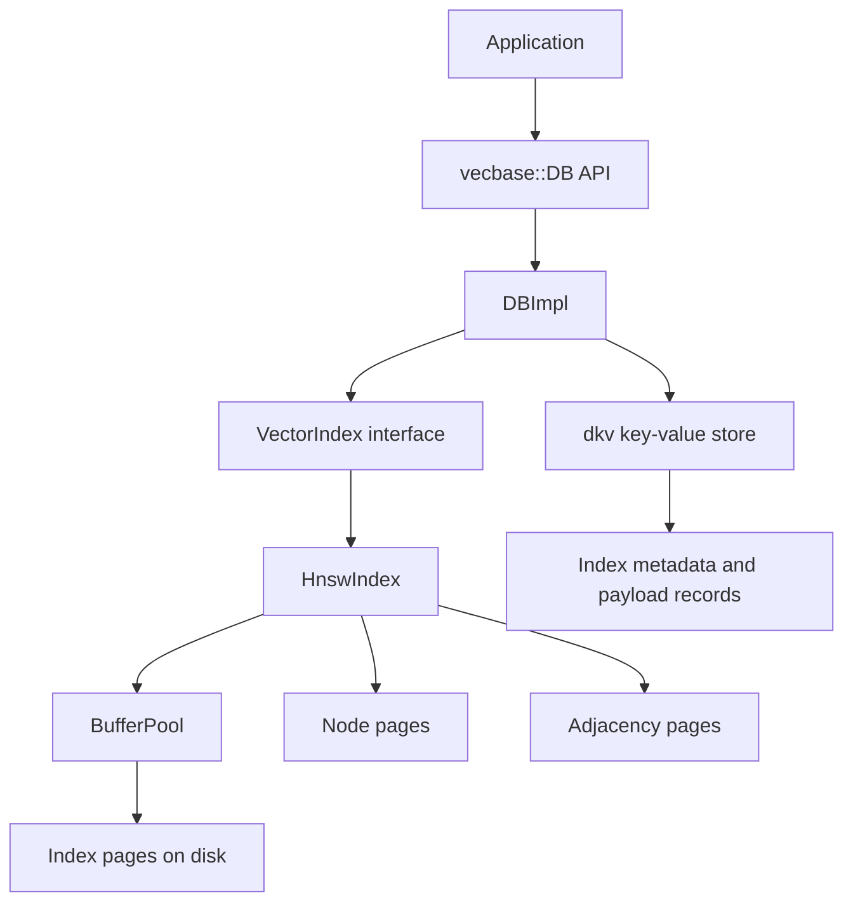

# vecbase

`vecbase` is a small embedded vector database implemented in C++. It combines a persistent metadata and payload layer on top of `dkv` with an on-disk HNSW index for approximate nearest neighbor search.

## Build

```bash
git clone https://github.com/DengY11/vecbase
cd vecbase
git submodule update --init --recursive
cmake -S . -B build
cmake --build build -j
```

## Example

The repository includes a runnable example at `examples/basic_usage.cc`.

```bash
./build/vecbase_example_basic
```

The example creates a local database under `examples/demo_db`, creates an index, inserts a few vectors with payloads, runs a search, and prints index stats.

## Architecture



### Data flow

1. `DBImpl` persists index metadata and record payloads into `dkv`.
2. Each logical index owns a `VectorIndex` implementation, currently `HnswIndex`.
3. `HnswIndex` stores graph structure and embeddings in paged files through `BufferPool`.
4. Search reads the graph from the HNSW storage file and optionally joins payloads from the in-memory payload map loaded from `dkv`.

## Project layout

- `include/vecbase/`: public API.
- `db/`: database facade, metadata persistence, WAL helpers, and recovery flow.
- `index/`: distance functions, HNSW implementation, and index page format.
- `table/`: page cache and storage primitives.
- `examples/`: runnable examples.
- `tests/`: integration-style tests.
