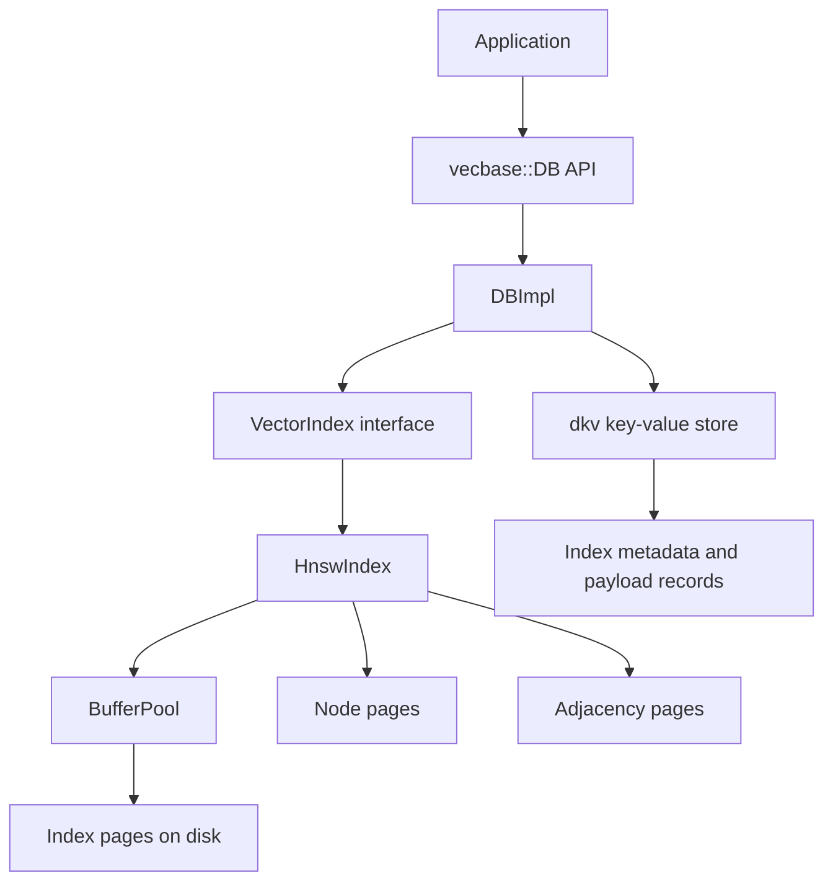
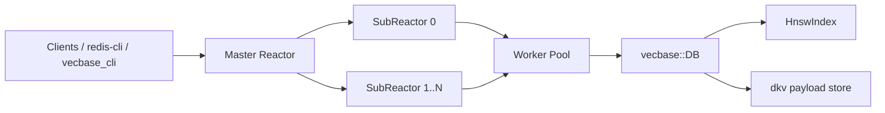

# vecbase

`vecbase` is a small embedded vector database implemented in C++. It combines a persistent metadata and payload layer on top of `dkv` with an on-disk HNSW index for approximate nearest neighbor search.

## Build

```bash
git clone https://github.com/DengY11/vecbase
cd vecbase
git submodule update --init --recursive
cmake -S . -B build
cmake --build build -j
```

## Example

The repository includes a runnable example at `examples/basic_usage.cc`.

```bash
./build/vecbase_example_basic
```

The example creates a local database under `examples/demo_db`, creates an index, inserts a few vectors with payloads, runs a search, and prints index stats.

## RESP Server And CLI

The repository also includes a small Redis-protocol-compatible server and CLI:

- `vecbase_server`: a master-reactor + subreactor server built on `epoll`
- `vecbase_cli`: a thin RESP client for sending commands and printing replies

Build and run:

```bash
cmake -S . -B build
cmake --build build -j

./build/vecbase_server --db-path ./vecbase-data --bind 127.0.0.1 --port 6380 --subreactors 4 --workers 4
```

In another shell:

```bash
./build/vecbase_cli --host 127.0.0.1 --port 6380 PING
./build/vecbase_cli --host 127.0.0.1 --port 6380 VCREATE docs 3 COSINE 8 32
./build/vecbase_cli --host 127.0.0.1 --port 6380 VPUT docs 1 1,0,0 alpha
./build/vecbase_cli --host 127.0.0.1 --port 6380 VPUT docs 2 0.9,0.1,0 beta
./build/vecbase_cli --host 127.0.0.1 --port 6380 VSEARCH docs 1,0,0 2 16 WITHPAYLOADS
```

Supported commands:

- `PING [message]`
- `ECHO <message>`
- `QUIT`
- `HELLO`
- `INFO`
- `COMMAND`
- `CLIENT ...`
- `VCREATE <index> <dimension> <metric> [max_degree] [ef_construction]`
- `VDROP <index>`
- `VLIST`
- `VHASINDEX <index>`
- `VPUT <index> <id> <vector_csv> [payload]`
- `VGET <index> <id>`
- `VDEL <index> <id>`
- `VSEARCH <index> <vector_csv> <top_k> [ef_search] [WITHPAYLOADS]`
- `VSTATS <index>`

## Architecture



### Server architecture



### Data flow

1. `DBImpl` persists index metadata and record payloads into `dkv`.
2. Each logical index owns a `VectorIndex` implementation, currently `HnswIndex`.
3. `HnswIndex` stores graph structure and embeddings in paged files through `BufferPool`.
4. Search reads the graph from the HNSW storage file and optionally joins payloads from the in-memory payload map loaded from `dkv`.
5. The RESP server uses a Redis-style master reactor for `accept()` and subreactors for socket I/O, protocol parsing, and response writeback.

## Project layout

- `include/vecbase/`: public API.
- `db/`: database facade, metadata persistence, WAL helpers, and recovery flow.
- `index/`: distance functions, HNSW implementation, and index page format.
- `table/`: page cache and storage primitives.
- `examples/`: runnable examples.
- `tests/`: integration-style tests.
